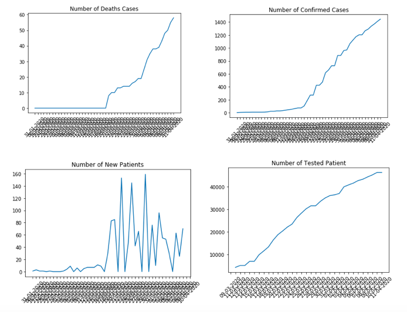
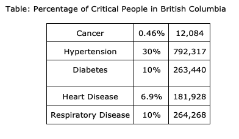
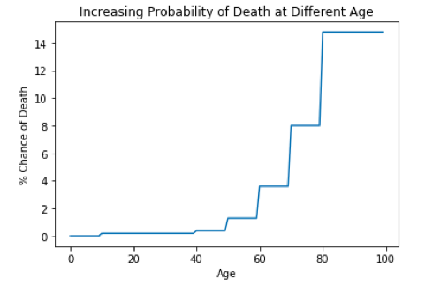
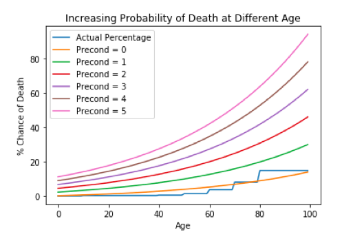
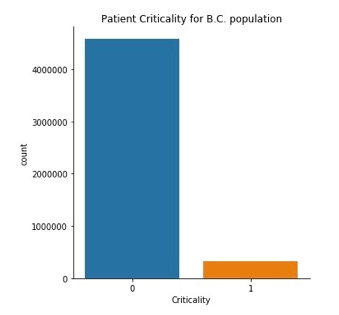
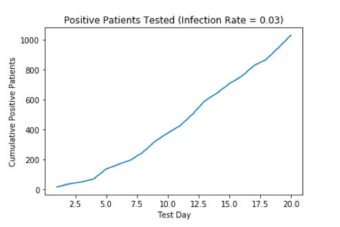
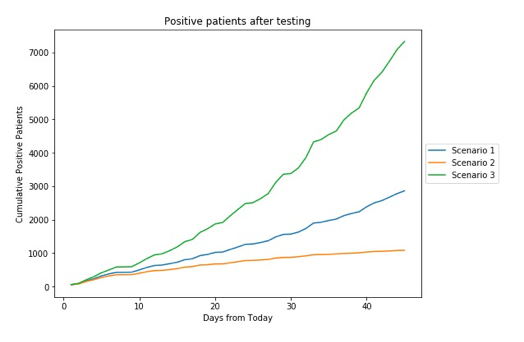
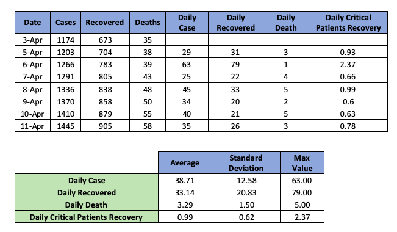

# Simulating Impact of COVID-19 restrictions relaxation on hospital resources in British Columbia

Research By: Nammn Joshii


## Introduction : 

The quality of the healthcare system is determined by the care process, affordability, timeliness, administrative efficiency, equipment and healthcare outcomes. Advancement in the healthcare system has improved the quality of life by providing better medication, faster treatment and cheaper treatment. This reinvention has improved the life-saving capacity of hospitals and reduced the hospital time required for patients over the years. The downside of all these advancements was the effect in the inventory of life-supporting equipment as fewer and fewer people required prolonged administered care and as a result, hospitals focused on making the treatment better with reduced inventory for the equipment.

The resilience of the system is put to test when an unexpected disaster, event or disease disrupts the normal routine. Currently, the world faces a similar situation with the ongoing spread of the Coronavirus (COVID-19) which has engulfed the entire world. COVID-19 is a respiratory illness with flu-like symptoms that primarily spreads through contact with an infected person when they cough or sneeze or through the contact of surfaces or objects that the virus was on.

COVID-19 is a highly communicable disease that affects people of all ages but older people and people with pre-condition such as asthma, diabetes, heart and lung disease are more vulnerable and may become severely ill. These vulnerable people if infected would require special administered care and in order to meet their needs, the Health Care System needs to identify these vulnerable people and decide the requirement of equipment and ICU bed. The pandemic has raised a lot of questions on the Health Care system’s ability to cope up with the requirements. The increasing death rate around the world shows how insufficient staffing and equipment management can overwhelm the Health Care System. This project addresses this issue of assessing the requirements in advance to give the Health Care facilities enough time to prepare for subsequent situations.

Currently, Canada lies 13th in the highest number of confirmed Coronavirus cases registered around the world. British Columbia registered its first case on January 21st, 2020 and since then it has been an exponential rise in the number of confirmed cases, currently at 1445 confirmed cases. To prevent the Health Care System from being overwhelmed by the increasing incoming cases, the simulation aims to predict the requirements and help in inventory management. This in turn will help in the recovery of the patients and will help minimize the death rate.


## Objective : 

To predict the population that would require critical care support in British Columbia, Canada and recommend resource requirements to BC Health Care facilities enabling effective management of COVID-19 pandemic. 

## Assumptions:

- The simulation has the latest information from 11th April 2020.
- There is no re-infection of Coronavirus to a patient who has already been infected.
- A patient is relieved from the ICU after 14 days.
- The number of health care workers is sufficient for the expected number of coronavirus cases.
- All the preconditions have equal weightage to make a person critically ill.
- A critical patient would require a ventilator capable critical care beds each (Throughout the report, ‘hospital resources’ indicates ventilator capable critical care beds).
- A closed case is when a COVID-19 infected patient has either recovered or died.

## Approach : 

- We start the analysis by understanding the current situation in British Columbia with respect to confirmed coronavirus cases and hospital resources available. 

- We then simulate age and pre-existing health conditions to determine the criticality of the patients. 

- Once we simulate critical patients, we build scenarios to check the magnitude of critical patients that will utilize the existing hospital resources and recommend additional resources if required. 


## Analysis :

### Understanding the current COVID-19 Scenario

As of April 11th, there were 1,445 confirmed positive COVID-19 cases in British Columbia of which 963 closed cases (Recovery = 905 and Deaths = 58). At present, British Columbia has 348 ventilator capable critical care beds available for COVID-19 patients. 




### Understanding  the demographics of British Columbia

Total British Columbia Population : 4,912,400

British Columbia (B.C.) has 65.3% of its population with age group 15 - 64 years. The Average age of the B.C. population is 42.3 years and the Median age of the B.C. population is 43 years. 


### Critical Population: 

People of all ages are infected by the coronavirus but the old population and people with pre-condition are most at risk from the disease. These severely susceptible people can get extremely ill and will require intensive care for their treatment. Below table shows the total number of critical population in BC




### Age-wise Death Percentage: 

Based on the data collected worldwide, the percentage of people who died at a particular age. 



 

### Simulating Mortality Curve for different age groups: 

Probability of Death increases exponentially with an increase in Age and the Number of Pre-Conditions. 




### Simulate Critical Cases for the population in British Columbia: 

The critical population of British Columbia who is defined as the age-sensitive population most likely to get critically ill. For a COVID-19 patient to be a critical cases we consider their age and  pre-conditions. Presented in a swarm plot below, the blue dots represent the population sample who if infected by COVID-19 would not require intensive care whereas the orange dots represent the population who would highly likely require intensive care. The people in orange are our critical groups, one who desperately need to receive treatment and prioritized if the were tested positive of COVID-19. 


We now need to extend this analysis to the entire population of British Columbia i.e. 4.5 million people to get a close approximation of how many people would fall in the critical category if everyone was infected by COVID-19.
 


### Simulating Infection rate Scenarios vs Available Hospital Resources: 

The reproduction factor (R0) for the COVID-19 is estimated by the scientists to be in the range of 2.2 - 2.7. Depending on the level of intervention strategies implemented, the rate of infection can be controlled and the health care facilities need to adjust to the number of critical cases produced. 


 
 
We now simulate the patient’s criticality for the below 3 scenarios for the next 45 days and map it with the available hospital resources to measure the impact of the critical care patients on the hospital infrastructure. 

- Scenario I: When the restrictions are relaxed but not completely removed with the infection rate of 3%, we expect it to increase to 6% in next 45 days

- Scenario II: When the restrictions stay the same with an infection rate of 3% currently, we expect it to go down to 1% by the end of the next 45 days. 

- Scenario III: When the restrictions are completely relaxed from tomorrow with an infection rate of 3% currently, we expect it to go up to 20% by the end of the next 45 days.

For each scenario, we measure the available hospital resources as 
Hospital Resources available = Active Critical Cases + New Critical Cases  - Closed Cases
where 
a)	Closed Cases consist of COVID-19 infected patients who have either recovered or died
b)	Patient death and recovery have been calculated based on the recent one-week data. (See Appendix) 


After running simulation for all the 3 scenarios we found that 
- Number of positive cases after testing 
a)  Scenario 1 = 1,085 positive cases
b)	Scenario 2 = 2,863 positive cases
c)	Scenario 3 = 7,328 positive cases


- Scenario 3 will exponentially strain the hospital resources with next 40 days, post which there will be a short of hospital infrastructure. 
a) Scenario 1 is a workable option and does not pose any impact on available hospital resources. 
b) Scenario 2 is the most idle and will help to curb the covid-19 infection at a higher. 


## Recommendation: 

The death rate of coronavirus is around 1% but due to the shortage of intensive care facilities, the death rate has risen to 10-12% in countries like Spain and Italy. This could have been avoided if the health facilities were well equipped in advance. This project aims to reduce the uncertainty rate by forecasting the requirements for BC health care under different scenarios so that they can equip themselves and reduce the congestion at hospital for their resources. 

Keeping the above analysis in mind, it is not advisable to completely relax the restrictions of lockdown as it exponentially strains the hospital resources. The most idle situation would be to continue the current restrictions till a permanent solution like vaccine is discovered. In case if the B.C. is thinking of reducing the restrictions then we would recommend to incrementally reduce restrictions in order to avoid resurge of the COVID-19 infection spread and congestion at the hospitals. 


## Appendix:  



### Sources and References 

- https://www.canada.ca/en/public-health/services/diseases/2019-novel-coronavirus-infection.html
- https://resources-covid19canada.hub.arcgis.com/pages/demographics
- https://www.indexmundi.com/canada/age_structure.html
- https://www.worldometers.info/coronavirus/coronavirus-age-sex-demographics/
- https://www.theglobeandmail.com/canada/british-columbia/article-bc-should-have-enough-beds-and-ventilators-for-covid-19-patients/
- https://ici.radio-canada.ca/info/2020/coronavirus-covid-19-pandemie-cas-carte-maladie-symptomes-propagation/ 
- https://www.theglobeandmail.com/canada/british-columbia/article-bc-should-have-enough-beds-and-ventilators-for-covid-19-patients/


```python

```
